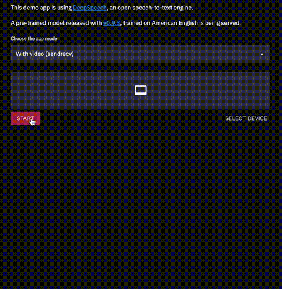

# streamlit-stt-app

A real time Speech-to-Text app built with Streamlit and [`streamlit-webrtc`](https://github.com/whitphx/streamlit-webrtc).
The STT engine is [`mozilla/DeepSpeech`](https://github.com/mozilla/DeepSpeech).

[Hosted on Streamlit Sharing](https://share.streamlit.io/whitphx/streamlit-stt-app/main/app_deepspeech.py).

The forum post about this app is
https://discuss.streamlit.io/t/new-component-streamlit-webrtc-a-new-way-to-deal-with-real-time-media-streams/8669/31.

